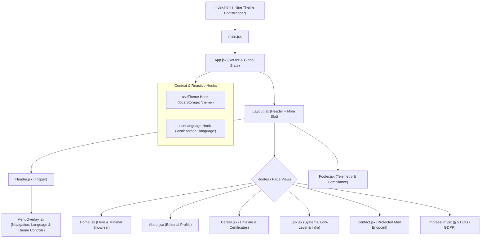

# System Architecture & Technical Foundations
**richardzuikov.com — Editorial Systems Portfolio**
*Version: 2.0.0 · Role: Principal Design Technologist & Senior Frontend Architect*

---

## 1. Executive Summary & Design System Axioms

`richardzuikov.com` is engineered as a high-contrast, editorial Swiss-minimalist portfolio website designed for a Systems Architect and Low-Level Software Engineer. It balances strict engineering aesthetics with rapid client-side performance.

### Core Architectural Principles
1. **Editorial Swiss Minimalism**: Asymmetric grid layouts, monumental typographic contrast, strict 4px/8px baseline rhythm, generous negative space, and complete avoidance of decorative gimmicks (no CRT scanlines, no terminal matrix rain, no flashing LEDs).
2. **Deterministic Performance Budget**: Ultra-lightweight critical path targeting **< 50 KB initial gzip transfer**, **sub-100ms First Contentful Paint (FCP)**, and zero layout shifts (**CLS = 0.00**).
3. **Ecosystem Boundary Isolation**: The root portfolio remains a lean, static hypermedia hub. Resource-intensive 3D sandboxes (e.g., the 19" Rack Three.js Configurator) and interactive web applications are segregated onto independent subdomains and integrated via static editorial preview cards.
4. **Resilient Isomorphic State**: Zero-flicker theme persistence (Warm Stone Dark & Pure Light) and instant dictionary-driven client localization (DE/EN) without DOM re-renders or page reloads.

---

## 2. System Topography & Component Hierarchy

The application runs as a Single Page Application (SPA) powered by React 18 and Vite, with declarative routing via React Router v6.

```
richardzuikov.com
├── index.html (Inline Anti-FOUC Theme Script + Root Container)
└── src/
    ├── main.jsx (React StrictMode Root Mount + Global SCSS)
    ├── App.jsx (Route Directory, Session State, Global AnimatePresence)
    ├── components/
    │   ├── Layout.jsx (Root Theme Container, Nav Shell & Main Slot)
    │   ├── Header.jsx (Floating Menu Trigger, Overlay State Manager)
    │   ├── MenuOverlay.jsx (Full-Screen Editorial Navigation + DE/EN + Theme Switches)
    │   ├── Footer.jsx (Subtle Telemetry Bar + § 5 DDG Legal Links)
    │   ├── IntroScreen.jsx (Optional Session-Gated Intro Screen)
    │   └── ui/ (Atomized UI Primitives)
    │       ├── CertificateModal.jsx (High-Fidelity Credential Inspector)
    │       ├── ProjectCard.jsx (Editorial Dual-Domain Showcase Card)
    │       └── ...
    ├── pages/
    │   ├── Home.jsx (Landing Screen & Work Showreel)
    │   ├── About.jsx (Systems Engineering Profile & Biography)
    │   ├── Career.jsx (Chronological Trajectory & Credential Vault)
    │   ├── Lab.jsx (Hardware Schematics, Low-Level R&D, IoT Projects)
    │   ├── Contact.jsx (Protected Direct Contact Channel)
    │   └── Impressum.jsx (§ 5 DDG Legal Disclosure & GDPR Privacy Policy)
    ├── hooks/
    │   ├── use-theme.jsx (Deterministic Dark/Light Mode Orchestration)
    │   ├── use-language.jsx (Reactive Localization Engine)
    │   └── use-outside-click.jsx (Spatial Modal Event Listener)
    └── data/ (Typed Static Content Schemas)
        ├── projects.json (Structured Project Definitions)
        ├── certificates.json (Verified Certifications & Credentials)
        └── dictionaries/ (DE / EN Lexicons)
```

### Component Data Flow & State Topography



---

## 3. Deterministic Theme Engine (Warm Dark & Pure Light)

The theme engine guarantees instantaneous, flicker-free rendering across client sessions without layout shifts or unstyled flash (FOUC).

### Color Token Architecture

The color system avoids harsh `#000000` pitch blacks and sterile cold grays in favor of **warm architectural stone** and **high-contrast slate**.

| Design Token | CSS Custom Property / Tailwind | Warm Dark Palette | Gallery-Grade Light Palette |
| :--- | :--- | :--- | :--- |
| **Canvas Background** | `bg-canvas` / `dark:bg-[#0c0a09]` | `#0c0a09` (Warm Stone 950) | `#f8fafc` (Slate 50) |
| **Elevated Surface** | `bg-surface` / `dark:bg-[#1c1917]` | `#1c1917` (Warm Stone 900) | `#ffffff` (Pure White) |
| **Subtle Border** | `border-subtle` / `dark:border-stone-800` | `#292524` (Stone 800 / 70%) | `#e2e8f0` (Slate 200) |
| **Interactive Border**| `border-hover` / `dark:border-stone-600` | `#44403c` (Stone 700) | `#cbd5e1` (Slate 300) |
| **Primary Ink** | `text-primary` / `dark:text-[#f5f5f4]` | `#f5f5f4` (Stone 100) | `#0f172a` (Slate 900) |
| **Secondary Ink** | `text-muted` / `dark:text-stone-400` | `#a8a29e` (Stone 400) | `#64748b` (Slate 500) |
| **Telemetry / Accent**| `text-accent` / `text-[#d97706]` | `#d97706` (Warm Amber 600) | `#b45309` (Warm Amber 700) |
| **Status Valid** | `text-emerald` | `#10b981` (Emerald 500) | `#059669` (Emerald 600) |

### Anti-FOUC Script (`index.html`)

To eliminate light/dark flicker before React hydrates, an inline synchronous script executes in the document `<head>`:

```html
<script>
  (function() {
    try {
      var saved = localStorage.getItem('theme');
      var prefersDark = window.matchMedia('(prefers-color-scheme: dark)').matches;
      if (saved === 'dark' || (!saved && prefersDark)) {
        document.documentElement.classList.add('dark');
      } else {
        document.documentElement.classList.remove('dark');
      }
    } catch (e) {}
  })();
</script>
```

### Reactive Theme Orchestration (`src/hooks/use-theme.jsx`)

```javascript
import { useEffect, useState, useCallback } from 'react';

export function useTheme() {
  const [theme, setTheme] = useState(() => {
    if (typeof window !== 'undefined') {
      const saved = localStorage.getItem('theme');
      if (saved) return saved;
      return window.matchMedia('(prefers-color-scheme: dark)').matches ? 'dark' : 'light';
    }
    return 'dark';
  });

  useEffect(() => {
    const root = document.documentElement;
    if (theme === 'dark') {
      root.classList.add('dark');
      localStorage.setItem('theme', 'dark');
    } else {
      root.classList.remove('dark');
      localStorage.setItem('theme', 'light');
    }
  }, [theme]);

  // Cross-tab and intra-app synchronization
  useEffect(() => {
    const handleSync = () => {
      const current = localStorage.getItem('theme') || 'dark';
      setTheme(current);
    };
    window.addEventListener('storage', handleSync);
    window.addEventListener('theme-change', handleSync);
    return () => {
      window.removeEventListener('storage', handleSync);
      window.removeEventListener('theme-change', handleSync);
    };
  }, []);

  const toggleTheme = useCallback(() => {
    const next = theme === 'dark' ? 'light' : 'dark';
    setTheme(next);
    localStorage.setItem('theme', next);
    window.dispatchEvent(new Event('theme-change'));
  }, [theme]);

  return [theme, toggleTheme];
}
```

---

## 4. Full Localization Engine (DE/EN Dictionary Architecture)

To ensure seamless bilingual support without external i18n bundle bloat, the portfolio uses a lightweight dictionary-based localization system.

### Dictionary Model

Translations are structured into decoupled JSON/JS lexicons:

```json
// src/data/dictionaries/de.json
{
  "nav": {
    "home": "Start",
    "about": "Über mich",
    "career": "Werdegang",
    "lab": "Labor & Systeme",
    "contact": "Kontakt",
    "legal": "Impressum & Datenschutz"
  },
  "telemetry": {
    "systemArch": "SYSTEMARCHITEKTUR // LOW-LEVEL",
    "location": "FLENSBURG, DEUTSCHLAND",
    "status": "VERFÜGBAR FÜR PROJEKTE"
  }
}
```

```json
// src/data/dictionaries/en.json
{
  "nav": {
    "home": "Home",
    "about": "About",
    "career": "Career",
    "lab": "Lab & Systems",
    "contact": "Contact",
    "legal": "Legal & Privacy"
  },
  "telemetry": {
    "systemArch": "SYSTEM ARCHITECTURE // LOW-LEVEL",
    "location": "FLENSBURG, GERMANY",
    "status": "AVAILABLE FOR CO-OP"
  }
}
```

### Reactive Dictionary Hook (`src/hooks/use-language.jsx`)

The hook provides instant state swapping across all mounted components:

```javascript
import { useState, useEffect, useCallback } from 'react';
import deDict from '../data/dictionaries/de.json';
import enDict from '../data/dictionaries/en.json';

const dictionaries = { de: deDict, en: enDict };

export function useLanguage() {
  const [lang, setLang] = useState(() => {
    if (typeof window !== 'undefined') {
      const saved = localStorage.getItem('language');
      if (saved && (saved === 'de' || saved === 'en')) return saved;
      return navigator.language.startsWith('de') ? 'de' : 'en';
    }
    return 'de';
  });

  useEffect(() => {
    localStorage.setItem('language', lang);
    document.documentElement.lang = lang;
  }, [lang]);

  useEffect(() => {
    const handleSync = () => {
      const saved = localStorage.getItem('language') || 'de';
      setLang(saved);
    };
    window.addEventListener('storage', handleSync);
    window.addEventListener('language-change', handleSync);
    return () => {
      window.removeEventListener('storage', handleSync);
      window.removeEventListener('language-change', handleSync);
    };
  }, []);

  const toggleLanguage = useCallback(() => {
    const next = lang === 'de' ? 'en' : 'de';
    setLang(next);
    localStorage.setItem('language', next);
    window.dispatchEvent(new Event('language-change'));
  }, [lang]);

  const t = dictionaries[lang] || dictionaries.de;

  return { lang, toggleLanguage, t };
}
```

---

## 5. Performance Budget & Bundle Optimization Strategy

```
┌─────────────────────────────────────────────────────────────┐
│                   BUNDLE BUDGET ALLOCATION                  │
├──────────────────────────┬──────────────┬───────────────────┤
│ Asset Category           │ Budget Limit │ Optimization Mode │
├──────────────────────────┼──────────────┼───────────────────┤
│ Critical Initial JS (Gz) │ ≤ 45.0 KB    │ Lazy route chunks │
│ Global CSS (Tailwind)    │ ≤ 8.0 KB     │ Purged & minified │
│ Typography (Geist Sans)  │ ≤ 28.0 KB    │ WOFF2 variable    │
│ Total Initial Transfer   │ ≤ 81.0 KB    │ HTTP/2 multiplex  │
│ First Contentful Paint   │ < 100 ms     │ Static SSR / Edge │
│ Cumulative Layout Shift  │ 0.000        │ Fixed aspect caps │
└──────────────────────────┴──────────────┴───────────────────┘
```

### Route-Level Code Splitting (`src/App.jsx`)

To ensure initial page load remains below the strict 50 KB ceiling, heavy route components are split into on-demand asynchronous bundles:

```javascript
import React, { Suspense, lazy } from 'react';
import { BrowserRouter as Router, Routes, Route } from 'react-router-dom';
import Layout from './components/Layout';

// Core Critical Route
import Home from './pages/Home';

// Lazy Chunks
const About = lazy(() => import('./pages/About'));
const Career = lazy(() => import('./pages/Career'));
const Lab = lazy(() => import('./pages/Lab'));
const Contact = lazy(() => import('./pages/Contact'));
const Impressum = lazy(() => import('./pages/Impressum'));

export default function App() {
  return (
    <Router>
      <Layout>
        <Suspense fallback={<div className="min-h-screen bg-stone-950" />}>
          <Routes>
            <Route path="/" element={<Home />} />
            <Route path="/about" element={<About />} />
            <Route path="/career" element={<Career />} />
            <Route path="/lab" element={<Lab />} />
            <Route path="/contact" element={<Contact />} />
            <Route path="/impressum" element={<Impressum />} />
            <Route path="/datenschutz" element={<Impressum />} />
          </Routes>
        </Suspense>
      </Layout>
    </Router>
  );
}
```

### Typography Optimization Protocol
- **Font Face**: Geist Sans Variable & Geist Mono Variable (`@fontsource-variable/geist`).
- **Font Display Policy**: `font-display: swap` combined with critical preloading in `index.html`.
- **Subsetting**: Latin-only unicode ranges (`U+0000-00FF, U+0131, U+0152-0153, U+02BB-02BC, U+02C6, U+02DA, U+02DC, U+2000-206F, U+2074, U+20AC, U+2122, U+2191, U+2193, U+2212, U+2215, U+FEFF, U+FFFD`).
- **Zero Runtime Icon Overhead**: Replaced external full SVG packages with selective imports from `lucide-react` tree-shaken down to single symbol declarations.
